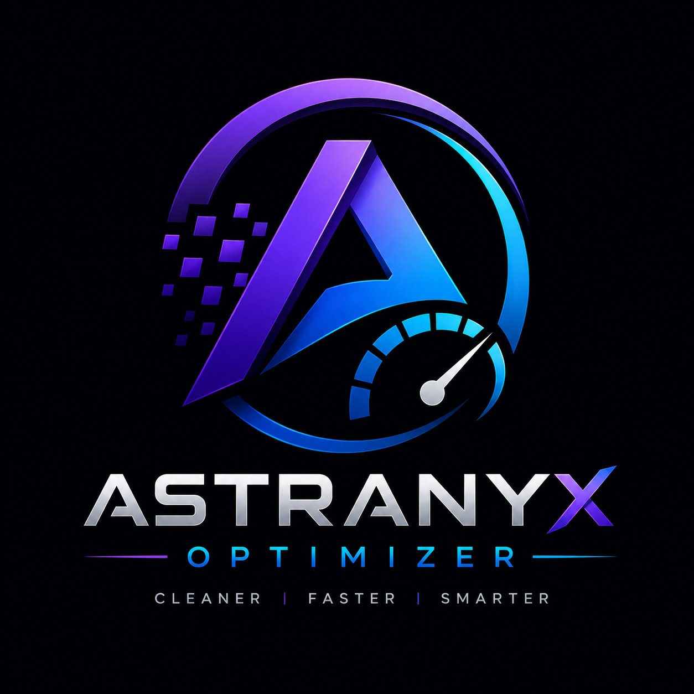

<div align="center">



# Astranyx Optimizer

**Advanced Windows PC Optimization Suite**

[](https://github.com/nishantnirwan/pc-optimizer/releases)
[](https://python.org)
[](https://github.com/nishantnirwan/pc-optimizer)
[](https://pypi.org/project/PyQt6/)
[](https://github.com/nishantnirwan/pc-optimizer/blob/main/LICENSE)
[](https://github.com/nishantnirwan/pc-optimizer)
[](https://astranyxoptimizer.netlify.app)

A professional, open-source Windows optimization utility with a modern Windows 11-inspired dark interface. Apply performance tweaks, privacy hardening, network optimizations, gaming improvements, and system cleanup - all silently in the background with zero command prompt popups.

**[Download Astranyx Optimizer](https://astranyxoptimizer.netlify.app)**

</div>

---

## Table of Contents

- [Overview](#overview)
- [Features](#features)
- [Tweak Categories](#tweak-categories)
- [Screenshots](#screenshots)
- [Requirements](#requirements)
- [Installation](#installation)
- [Building the EXE](#building-the-exe)
- [Project Structure](#project-structure)
- [How It Works](#how-it-works)
- [Safety](#safety)
- [Changelog](#changelog)
- [License](#license)

---

## Overview

Astranyx Optimizer is a full-featured Windows desktop application built with Python and PyQt6. It provides 132 individual system tweaks organized across 10 categories, presented in a polished dark UI with animated components, real-time progress feedback, and complete silent background execution.

Every registry edit, PowerShell command, and service configuration runs invisibly using the Windows `CREATE_NO_WINDOW` flag and `STARTUPINFO` suppression. No console windows. No interruptions. Clean and professional from start to finish.

---

## Features

**Professional UI**
- Windows 11-inspired deep dark theme with glass morphism card design
- Animated toggle switches running at 60fps with cubic easing
- Gradient violet accent sidebar with active state indicators
- Tabbed category pages with smooth section navigation
- Live progress dialog with animated gradient progress bar

**Silent Execution**
- Zero PowerShell or CMD popup windows during any operation
- All subprocess calls use `CREATE_NO_WINDOW` (0x08000000) and `STARTUPINFO` with `SW_HIDE`
- Background worker threads keep the UI fully responsive during tweaks

**System Dashboard**
- Automatic PC specs detection (CPU, GPU, RAM, storage, OS build, form factor)
- NVIDIA GPU detection with dedicated tuning section
- Laptop vs desktop auto-detection to show relevant power plans
- One-click system restore point creation before applying tweaks

**Tweak Management**
- Enable individual tweaks with toggle switches
- Select all visible tweaks on the current page in one click
- Clear all selections across all categories at once
- Live counter showing how many tweaks are currently selected

---

## Tweak Categories

| Category | Subcategories | Tweaks |
|---|---|---|
| Quick Fixes | One-click repairs | 12 |
| Performance | CPU, RAM, GPU, Storage | 29 |
| Network | TCP/IP latency, DNS, Wi-Fi | 15 |
| Gaming | System, input & mouse | 12 |
| NVIDIA | Laptop (Optimus), Desktop | 13 |
| Power Plans | Laptop power, Desktop power | 14 |
| Services | Unnecessary background services | 10 |
| Cleaner | Junk files, cache, logs | 10 |
| Privacy | Telemetry, tracking, debloat | 17 |
| **Total** | | **132** |

### Quick Fixes (12)
Flush DNS, release/renew IP, reset Winsock stack, System File Checker, DISM health restore, clear temp files, empty recycle bin, disk cleanup, restart Explorer, re-register Windows Store, clear font cache, rebuild icon cache.

### Performance - CPU (9)
Disable core parking, high-resolution multimedia timer, disable Spectre/Meltdown patches, foreground CPU boost, disable CPU idle C-states, disable dynamic tick, disable NTFS last access timestamps, disable 8.3 filename creation.

### Performance - RAM (7)
Disable page combining, standby list management, optimize page file, disable SysMain/SuperFetch, optimize prefetch settings, enable SSD TRIM, clear page file on shutdown.

### Performance - GPU (6)
Hardware GPU scheduling, disable fullscreen optimizations, disable all visual effects, disable transparency, disable Multiplane Overlay (MPO), disable Variable Refresh Rate.

### Performance - Storage (6)
Enable disk write cache, I/O priority boost, disable NTFS encryption overhead, disable search indexing, disable auto-defragment, disable hibernation.

### Network - Latency (8)
Disable Nagle's algorithm, disable Teredo tunneling, disable network throttling, remove QoS bandwidth reservation, optimize TCP auto-tuning, disable ECN, enable CTCP, enable Receive Side Scaling.

### Network - DNS (4)
Set Cloudflare DNS (1.1.1.1), set Google DNS (8.8.8.8), disable LLMNR, disable NetBIOS name resolution.

### Network - Wi-Fi (3)
Disable Wi-Fi power management, reduce roaming aggressiveness, disable background Wi-Fi scanning.

### Gaming (12)
Enable Game Mode, disable Game DVR, disable Xbox background services, remove Game Bar overlay, disable mouse acceleration, enable raw input, set GPU scheduling priority, enable shader cache, boost CSRSS priority, increase keyboard repeat rate, fix mouse input smoothing.

### NVIDIA (13)
Laptop: force NVIDIA GPU preference, maximum performance mode, disable Optimus battery throttle, enable shader cache, low latency mode, increase TDR delay. Desktop: force dedicated GPU, max performance, enable MSI mode, increase TDR timeout, force PhysX to GPU, enable shader disk cache, enable GPU memory trim.

### Power Plans (14)
Laptop: Ultimate Performance plan, Balanced plan, disable sleep on lid close, increase screen timeout, force CPU boost, disable USB selective suspend, disable PCIe power management. Desktop: Ultimate Performance plan, High Performance plan, disable sleep and hibernation, lock CPU to 100%, disable PCIe ASPM, disable USB selective suspend, disable hard disk power-down.

### Services (10)
Fax, Tablet Input, Remote Registry, Print Spooler, Windows Media Player Sharing, Remote Desktop, Geolocation, HomeGroup, Retail Demo, Mixed Reality Portal.

### Cleaner (10)
Temp folder contents, prefetch cache, recycle bin, all event logs, Windows Update cache, DNS cache, thumbnail cache, Edge/IE cache, crash dump files, Delivery Optimization cache.

### Privacy (17)
Telemetry: diagnostic data, CompatTelRunner tasks, Cortana, feedback notifications, Windows Error Reporting, CEIP scheduled tasks. Tracking: advertising ID, activity history, location tracking, camera access, microphone access, settings sync. Debloat: OneDrive removal, Windows tips and suggestions, disable AutoPlay/AutoRun, disable Bing in Start Search, disable lock screen Spotlight ads.

---

## Requirements

- Windows 10 version 1903 or later, or Windows 11
- Python 3.10 or later
- PyQt6
- Administrator privileges (required for registry writes and service configuration)

---

## Installation

**Run from source**

```
git clone https://github.com/nishantnirwan/pc-optimizer.git
cd pc-optimizer
pip install PyQt6
```

Then right-click `run.bat` and select Run as Administrator, or run from an elevated command prompt:

```
python astranyx_optimizer.py
```

The application will automatically request elevation via UAC if it is not already running as Administrator.

**Install dependencies manually**

```
pip install PyQt6
```

No other third-party dependencies are required. The application uses only Python standard library modules alongside PyQt6.

---

## Building the EXE

A `build.bat` script is included that automates the full build process using PyInstaller.

1. Ensure Python 3.10+ is installed and added to PATH
2. Right-click `build.bat` and select **Run as Administrator**
3. The script will automatically install PyQt6 and PyInstaller if not present
4. The finished executable will appear at `dist\Astranyx Optimizer.exe`

The build uses `--windowed` mode and `--uac-admin` so the final EXE requests elevation on launch and opens with no console window.

**Manual build command**

```
pip install pyinstaller
pyinstaller --onefile --windowed --name "Astranyx Optimizer" --uac-admin --icon astranyx.ico astranyx_optimizer.py
```

---

## Project Structure

```
astranyx-optimizer/
├── astranyx_optimizer.py     Main application (logo embedded as base64)
├── astranyx.ico              Window and taskbar icon for the compiled EXE
├── astranyx_logo.png         Logo source image
├── build.bat                 One-click EXE builder script
└── README.md                 This file
```

The logo PNG is embedded directly inside `astranyx_optimizer.py` as a base64 string so the application is fully self-contained and requires no external asset files at runtime.

---

## How It Works

**Subprocess execution**

Every shell command, PowerShell script, and registry operation that spawns a child process uses two Windows-specific suppression mechanisms:

```python
_NO_WINDOW = 0x08000000  # CREATE_NO_WINDOW process creation flag

def _si():
    si = subprocess.STARTUPINFO()
    si.dwFlags |= subprocess.STARTF_USESHOWWINDOW
    si.wShowWindow = subprocess.SW_HIDE
    return si

subprocess.run(cmd, creationflags=_NO_WINDOW, startupinfo=_si())
```

This is applied to all four dispatcher functions (`run`, `run_ps`, `run_get`, `_ps_get`) which cover every operation in the application.

**Threading model**

All tweak execution, PC spec detection, and restore point creation run on `QThread` worker threads, keeping the Qt event loop - and therefore the UI - fully responsive at all times. Workers emit progress signals that update the dialog on the main thread.

**Tweak definitions**

Each tweak is a plain Python dictionary with an `id`, `name`, `desc`, `risk` level, and an `apply` lambda that performs the actual system change. The `_tweaks()` function returns all 132 tweaks organized into a dictionary of category lists. This makes it straightforward to add, remove, or modify individual tweaks without touching any UI code.

```python
{
    "id":    "cpu_parking",
    "name":  "Disable CPU Core Parking",
    "desc":  "Keeps all CPU cores active, preventing spin-up latency spikes.",
    "risk":  "safe",
    "apply": lambda: rset(r"SYSTEM\...", "ValueMax", 100)
}
```

**Risk levels**

| Level | Meaning |
|---|---|
| SAFE | No meaningful downside. Recommended for most users. |
| CAUTION | Performance or behavior trade-off. Read the description before enabling. |
| RISK | Security or stability impact. Create a restore point first. |

---

## Safety

- Creating a **System Restore Point** before applying tweaks is strongly recommended and is built into the Dashboard
- All registry changes are reversible through System Restore or by manually reverting the values
- Tweaks marked RISK (such as disabling Spectre/Meltdown patches or disabling Remote Desktop) have security implications - enable them only if you understand the trade-off
- The application does not connect to the internet, does not collect any data, and does not modify any files outside of the Windows registry and system configuration

---

## Changelog

### v3.0
- Fixed all PowerShell and CMD popup windows via `CREATE_NO_WINDOW` and `STARTUPINFO` suppression on every subprocess call
- Redesigned UI with Windows 11-inspired deep dark theme and glass morphism cards
- New 60fps animated toggle switches with cubic easing
- New gradient accent sidebar navigation with active state indicator
- New progress dialog with animated gradient progress bar and live percentage counter
- PC spec loading deferred to 350ms after startup - application opens instantly
- Segoe UI Variable Display typography with consistent weight and size hierarchy
- Refined color system: deep navy backgrounds, vivid violet accents, clear contrast ratios
- 16ms animation timer replacing previous 10ms polling
- Removed all unused imports and dead code

### v2.0
- Added NVIDIA optimization section (laptop and desktop)
- Added tabbed page layout for multi-subcategory sections
- Added system restore point creation
- Expanded privacy and debloat tweaks

### v1.0
- Initial release with core performance, network, gaming, and cleaner categories

---

## License

This project is licensed under the MIT License. See the [LICENSE](https://github.com/nishantnirwan/pc-optimizer/blob/main/LICENSE) file for details.
